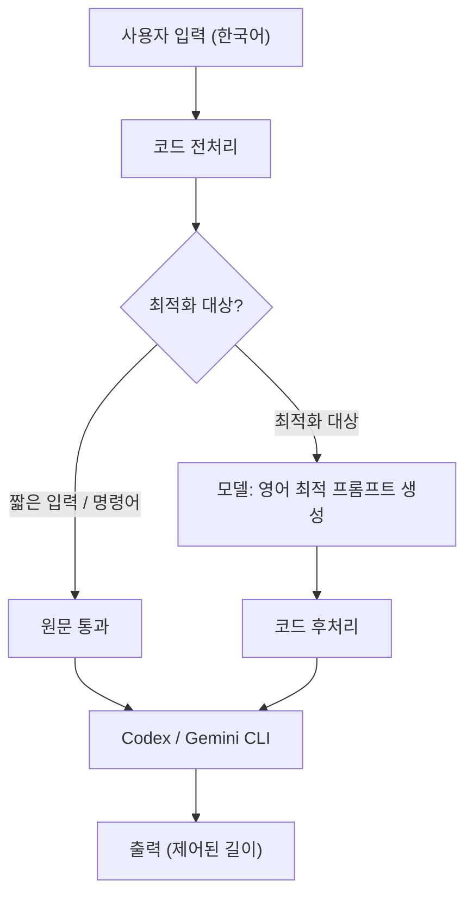
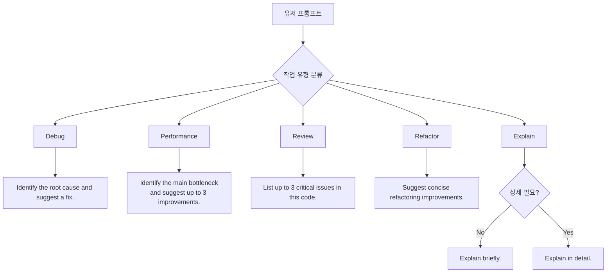
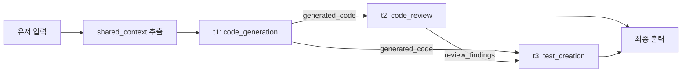
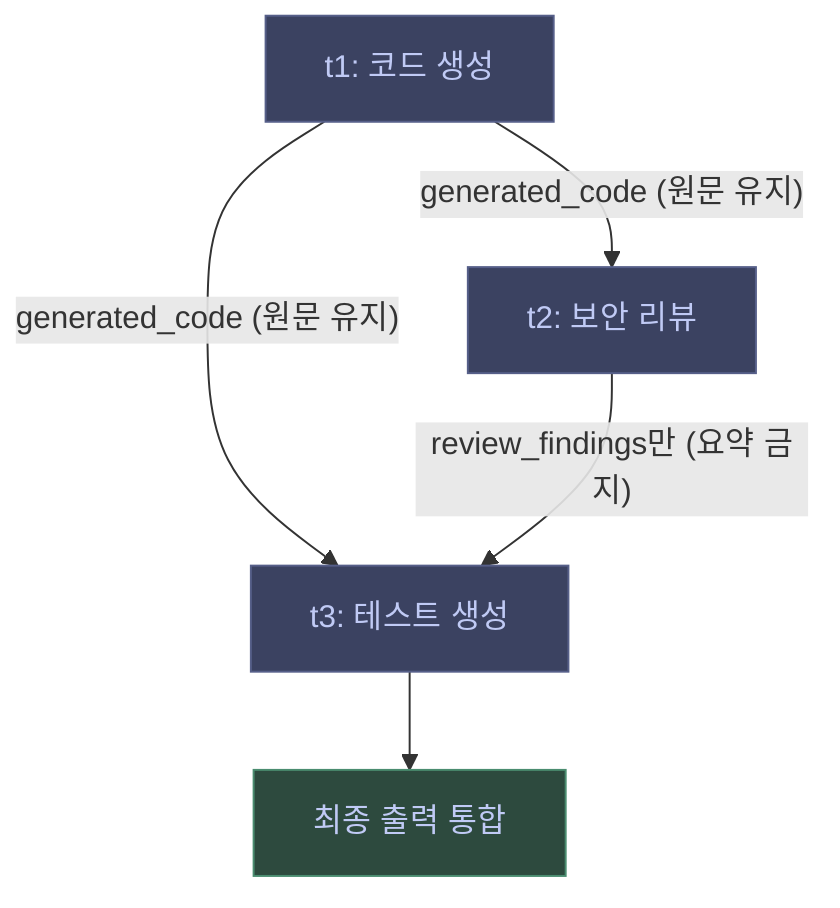

**팀:** 규철(팀장), 시호, 지호, Evan — 4명  
**서비스명:** Tokit  
**일정:** 4월 20일 ~ 5월 1일 (NLP 프로젝트) → 이후 2주 (서비스 개발)

프로젝트 시작 전, 팀장 규철님이 정리한 아이디어를 바탕으로 Tokit이 무엇을 만들고 왜 만드는지 정리해두는 글이다.

---

## 무엇을 만드는가

**Tokit은 LLM CLI를 위한 프롬프트 컴파일러다.**

한국어로 작성된 개발자 프롬프트를 받아서, 더 짧고 명확한 영어 명령으로 변환한다. 이 과정에서 입력 토큰과 출력 토큰을 동시에 줄이는 것이 목표다.

핵심은 "번역"이 아니라 "컴파일"이다.

<div class="compare-wrap">
  <div class="compare-card compare-before">
    <div class="compare-label">단순 번역</div>
    <div class="compare-body">
      <code>Please explain this code in detail...</code>
      <p>의미만 옮긴다. 길이와 출력 토큰은 그대로다.</p>
    </div>
  </div>
  <div class="compare-card compare-after">
    <div class="compare-label">Tokit 컴파일</div>
    <div class="compare-body">
      <code>Explain this code briefly and identify the main issue.</code>
      <p>의미 유지 + 길이 압축 + 출력 형식 제어.</p>
    </div>
  </div>
</div>

번역은 의미만 옮긴다. 컴파일은 의미를 유지하면서 길이를 줄이고, 출력 형식까지 제어한다.

---

## 프로젝트 목표

- 입력 토큰 감소
- 출력 토큰 감소
- 성능 유지 또는 향상
- Codex CLI / Gemini CLI와 완전 호환

---

## 전체 흐름



시스템은 두 레이어로 나뉜다.

### 코드 로직 레이어

빠르고 안전하게 처리해야 할 것들을 담당한다.

- slash command pass-through (`/`, `@`, `!`) — 기존 CLI 명령어는 건드리지 않는다
- 코드블록 / 파일경로 / 에러 메시지 보호
- 짧은 입력 필터링 (최적화 대상이 아닌 경우 원문 그대로 통과)
- 토큰 계산, 캐싱, diff/log 출력

### 모델 레이어

입력 프롬프트에서 세 가지를 처리한다.

1. **의미 파악** — 사용자의 실제 작업 의도 추출
2. **영어 변환** — 항상 영어로 출력
3. **프롬프트 최적화** — 명령형, 짧고 명확하게, 출력 길이 제어 포함

---

## 토큰을 어떻게 줄이는가

### 입력 토큰

- 군더더기 표현 제거
- 명령형으로 변환
- 중복 내용 제거
- 영어로 압축

입력 토큰은 설계와 무관하게 확실히 줄어든다.

### 출력 토큰

프롬프트 안에 출력 형식을 강제하는 지시문을 추가한다.

```
in 3 bullet points
keep it concise
only root cause and fix
```

출력 토큰은 작업 유형과 설계에 따라 달라진다.

---

## 작업 유형별 최적화 정책

유저 프롬프트가 어떤 종류의 작업인지 분류하고, 그에 맞는 출력 제어 전략을 적용한다.



| 작업 유형   | 최적화된 프롬프트 예시                                           | 출력 제어 강도 |
| ----------- | ---------------------------------------------------------------- | -------------- |
| Debug       | `Identify the root cause and suggest a fix.`                     | 강             |
| Performance | `Identify the main bottleneck and suggest up to 3 improvements.` | 중             |
| Review      | `List up to 3 critical issues in this code.`                     | 강             |
| Refactor    | `Suggest concise refactoring improvements.`                      | 중             |
| Explain     | `Explain briefly.` (필요 시 `Explain in detail.`)                | 선택적         |

Explain 타입만 예외적으로 길어질 수 있다. 나머지는 기본적으로 짧게 강제한다.

---

## 설계 원칙

1. **always-on** — 모든 프롬프트를 처리한다. 필터링 조건을 만족하지 못하면 원문 그대로 통과시킨다.
2. **명령어는 건드리지 않는다** — `/`, `@`, `!`로 시작하는 CLI 명령어는 패스스루.
3. **출력은 기본값으로 짧게** — verbose 모드는 opt-in.
4. **전체 비용으로 평가한다** — `최적화 모델 비용 + 메인 모델 비용`이 함께 줄어야 성공.

---

## 기존 LLM 서비스와 어떻게 다른가

OpenAI, Google 같은 서비스들은 이미 내부에서 컨텍스트 압축과 정보 필터링을 수행한다. 그렇다면 Tokit은 중복인가?

잘못 설계하면 그렇게 된다. 핵심은 **모델이 이미 잘 하는 것을 다시 하지 않는 것**이다.

### 모델이 하지 않는 것

| 모델이 못하는 영역 | 이유                                                                                 |
| ------------------ | ------------------------------------------------------------------------------------ |
| 비용 최적화        | 모델의 목표는 정확한 답이지, 토큰 비용 최소화가 아니다                               |
| 세션 전체 최적화   | 모델은 요청 1건 단위로만 판단한다                                                    |
| 외부 데이터 정제   | 툴 출력(logs, HTML, JSON)은 모델이 그대로 받는다. Tokit은 들어가기 전에 줄일 수 있다 |

### Tokit이 해야 할 방향

- **모델이 받기 전에 정제** — 툴 출력, 로그 압축, HTML → 구조화 데이터 변환
- **반복 루프 최적화** — 이전 결과 캐싱, 중복 요청 제거, diff 기반 업데이트
- **중요도 기반 필터링** — 에러 메시지는 유지, 성공 로그는 제거, stack trace는 축소
- **구조화 압축** — 자연어 대신 JSON으로 정보 전달 (토큰 감소 + 의미 보존)

<div class="callout callout-key">
  <p class="callout-label">판단 기준</p>
  <p>이 최적화가 <strong>모델 없이도 의미 있는가?</strong> YES면 Tokit이 해야 할 일이다. NO면 모델이 이미 하고 있는 것과 중복된다.</p>
</div>

| 작업           | 평가                |
| -------------- | ------------------- |
| 긴 문장 줄이기 | ❌ 모델이 이미 잘함 |
| JSON 정리      | ✅ 가치 있음        |
| 로그 필터링    | ✅ 매우 중요        |
| 히스토리 요약  | ⚠️ 상황에 따라 다름 |
| 캐싱           | ✅ 모델이 못함      |

---

## 복합 요청 처리

유저가 "코드 생성, 리뷰, 테스트"처럼 여러 작업을 한 번에 요청하는 경우, 단일 카테고리로 분류하면 정보가 손실된다.

```json
{ "category": "code_generation" } // ❌ 나머지 작업이 사라짐
```

대신 작업 그래프로 분해한다.

```json
{
  "intent": "multi_step_dev_request",
  "tasks": [
    { "type": "code_generation" },
    { "type": "code_review" },
    { "type": "test_creation" }
  ]
}
```

작업 간 의존 관계와 실행 순서를 그래프로 표현하면 이렇다.



### 공유 컨텍스트 분리

세 작업이 공통으로 쓰는 정보를 매번 반복하면 토큰이 낭비된다. `shared_context`로 한 번만 정의하고, 각 작업에는 차이점만 담는다.

```json
{
  "shared_context": {
    "language": "Node.js",
    "feature": "JWT authentication middleware"
  },
  "tasks": [
    { "type": "code_generation", "task_context": {} },
    {
      "type": "code_review",
      "task_context": { "focus": ["security", "maintainability"] }
    },
    { "type": "test_creation", "task_context": { "framework": "jest" } }
  ]
}
```

### 단계 간 상태 전달

각 단계마다 전체 대화를 다시 넘기면 컨텍스트가 계속 커진다. 각 단계의 결과를 정규화된 상태(state)로 저장하고, 다음 단계에는 필요한 것만 전달한다.



- 리뷰 단계 → 코드 + 최소 요구사항만
- 테스트 단계 → 최종 코드 구조 + 리뷰에서 발견된 위험 포인트만

### 압축하면 안 되는 것

<div class="callout callout-warn">
  <p class="callout-label">압축 금지 구간</p>
  <p>생성된 코드 본문, 에러 메시지 원문, 보안 리뷰 발견 이슈, 함수 시그니처는 <strong>절대 요약하지 않는다.</strong> 이 정보를 잃으면 다음 단계 품질이 무너진다.</p>
</div>

| 압축 금지                  | 압축 가능            |
| -------------------------- | -------------------- |
| 생성된 코드 본문           | 반복된 배경 설명     |
| 에러 메시지 원문           | 해결된 이전 논의     |
| 보안 리뷰 발견 이슈        | 중요도 낮은 코멘트   |
| 함수 시그니처 / 인터페이스 | 성공 로그, 중복 설명 |

---

## Base System Prompt

현재 정리된 시스템 프롬프트다. MVP 개발의 시작점이 된다.

```
You are a prompt compiler for developer-focused LLM workflows.

Convert a Korean developer prompt into a compact, precise English prompt for a coding LLM.

Rules:
- Preserve the core task, constraints, and requested output format.
- Always output English.
- Use concise, command-oriented phrasing.
- Remove redundant or polite wording.
- Keep technical terms, code symbols, file names, paths, commands, and error messages unchanged when possible.
- Minimize likely input and output token usage without losing important meaning.
- Output only the final optimized English prompt.
```

---

## 기대 효과와 리스크

| 항목      | 예상 결과           |
| --------- | ------------------- |
| 입력 토큰 | 확실히 감소         |
| 출력 토큰 | 작업 유형별로 감소  |
| 총 비용   | 설계에 따라 감소    |
| 응답 품질 | 유지 또는 향상 가능 |

<div class="callout callout-warn">
  <p class="callout-label">주요 리스크</p>
  <p>의미 손실(압축 중 조건 누락), 지연 증가(매 프롬프트마다 모델 추가 호출), 짧은 입력에서 오히려 손해. 세 가지 모두 <strong>fallback + 캐싱 + 입력 길이 필터링</strong>으로 대응한다.</p>
</div>

**대응 방향:**

- 짧은 입력은 필터링해서 원문 통과 (fallback)
- 캐싱으로 반복 호출 최소화
- 빠르고 가벼운 모델 사용

---

## 일정

| 기간               | 내용                                  |
| ------------------ | ------------------------------------- |
| 4월 20일 ~ 5월 1일 | NLP 프로젝트 — 프롬프트 컴파일러 구현 |
| 5월 초 ~ 5월 중순  | 서비스 프로젝트 — Tokit 서비스화      |

---

## 한 줄 요약

<div class="callout callout-key">
  <p class="callout-label">Tokit이 만드는 것</p>
  <p>개발자가 한국어로 프롬프트를 입력하면, Tokit이 그것을 <strong>더 짧고 명확한 영어 명령으로 컴파일</strong>해서 Codex / Gemini CLI에 넘긴다. 번역이 아니라 압축이다. 입력 토큰과 출력 토큰을 동시에 줄이는 것이 목표다.</p>
</div>

구체적으로 만드는 것은 세 가지다.

**1. 프롬프트 컴파일러** — 한국어 입력을 받아 작업 유형(Debug / Review / Explain 등)을 분류하고, 각 유형에 맞는 짧은 영어 명령으로 재작성한다. 출력 형식 제어(`in 3 bullet points`, `only root cause and fix`)도 프롬프트 안에 포함시킨다.

**2. 입력 전처리 레이어** — `/`, `@`, `!` 명령어는 건드리지 않고, 짧은 입력은 원문 그대로 통과시킨다. 툴 출력(logs, JSON, HTML)은 모델에 넘기기 전에 정제한다.

**3. 반복 루프 최적화** — 복합 요청(코드 생성 → 리뷰 → 테스트)을 작업 그래프로 분해하고, 각 단계에는 전체 대화 대신 필요한 상태(state)만 전달해 컨텍스트가 눈덩이처럼 커지는 걸 막는다.

이 세 가지가 합쳐진 시스템이 Tokit이다.
